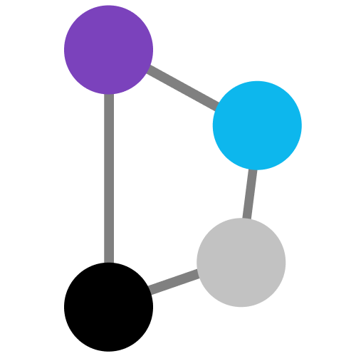

  

# Terry the Terraformer

A Python CLI tool for building a red team infrastructure using Terraform, Ansible, and Docker. Once deployed, all resources can be integrated into a [Nebula network](https://github.com/slackhq/nebula) for secure communications across nodes as well as with centralized logging that all goes through Logstash and into an Elastic Stack.

## Documentation

Most documentation can be found in the [Wiki pages](https://github.com/ezra-buckingham/terry-the-terraformer/wiki). If there is something missing or unclear, please create a GitHub issue.

## Getting Started

Getting started is relatively easy. Follow the [Getting Started](https://github.com/ezra-buckingham/terry-the-terraformer/wiki/Getting-Started) instructions to begin using Terry.

## Contributors / Acknowledgement

I would like to thank all the people who have helped with the architecture of this project and the development of each piece. Initially, this project came to life from a co-worker, [WJDigby](https://github.com/WJDigby). He had a much cooler name for the project than Terry. And not to mention all the people in BloodHound Slack that I pestered for getting feedback on this solution. Thank you!

 Ezra Buckingham @BuckinghamEzra
 Lee Baird @discoverscripts

## Known Issues

Terry contains a few known issues. Below are some of the ones I have identified:

* No central management of wildcard certs (wildcard cert generation likely coming in the future)
* PTR records need to be determined before SMTP will work
  * DigitalOcean will create PTR records from the name of the host, need to make sure name of host is the FQDN

## What's Next?

* Adding a secrets management solution to Terry to allow for dynamic generation of secrets and automatic pushing of secrets to a secure place
* Timeout date on infra (auto-destroy)
* Give CIDR blocks for firewall rules
* Put path to SSH key in config
* Scan Terraform code for vulnerabilities
